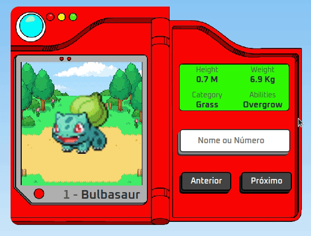

<h1 align="center">
    
    <a href="https://paulomvrech.github.io/wireframe-project/" target="_blank">Pokédex</a>
      
</h1>

## 💻 Sobre o projeto

Projeto desenvolvido para estudo utilizando a API **[PokéAPI](https://pokeapi.co/)**. Esta API consta com várias informações referentes a todos os Pokémons.

A ideia do projeto era acessar algumas informações desta API e mostra-las em tela em forma de uma Pokédex, buscando o Pokémon através de seu número(ID) ou o próprio nome!

---

## 👀 Demo

- Versão Desktop
<div align="center">
    
</div>

---

## 🚀 Tecnologias utilizadas

Esse projeto foi desenvolvido utilizando as seguintes tecnologias:

- HTML5
- CSS3
- Javascript

---

## 🛠 Como executar o projeto em sua máquina

```bash

# Clone este repositório
$ git clone https://github.com/paulomvrech/pokedex.git

# Acesse a pasta do projeto no seu terminal/cmd
$ cd pokedex

# Execute o arquivo index.html em seu navegador


```

---

<p align="center">Desenvolvido por 👏 Paulo Muller Vrech</p>
